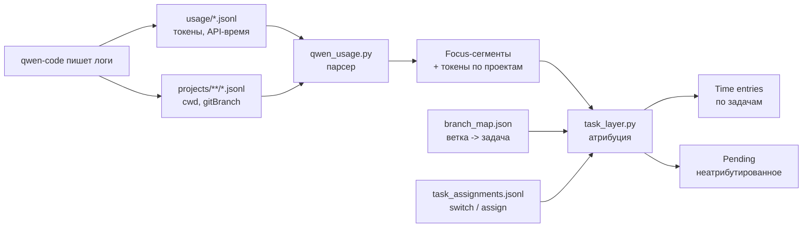
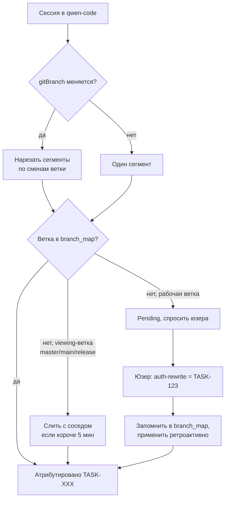
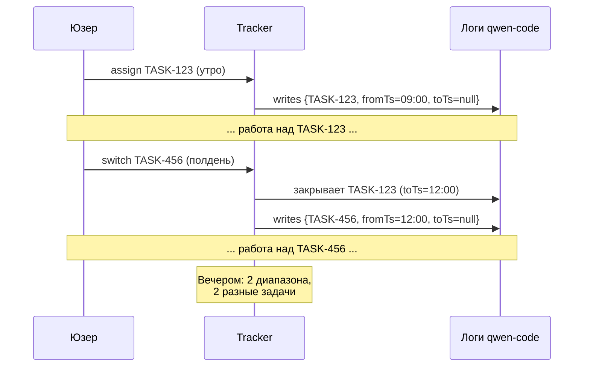
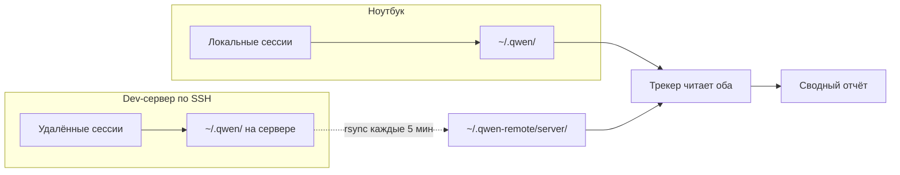
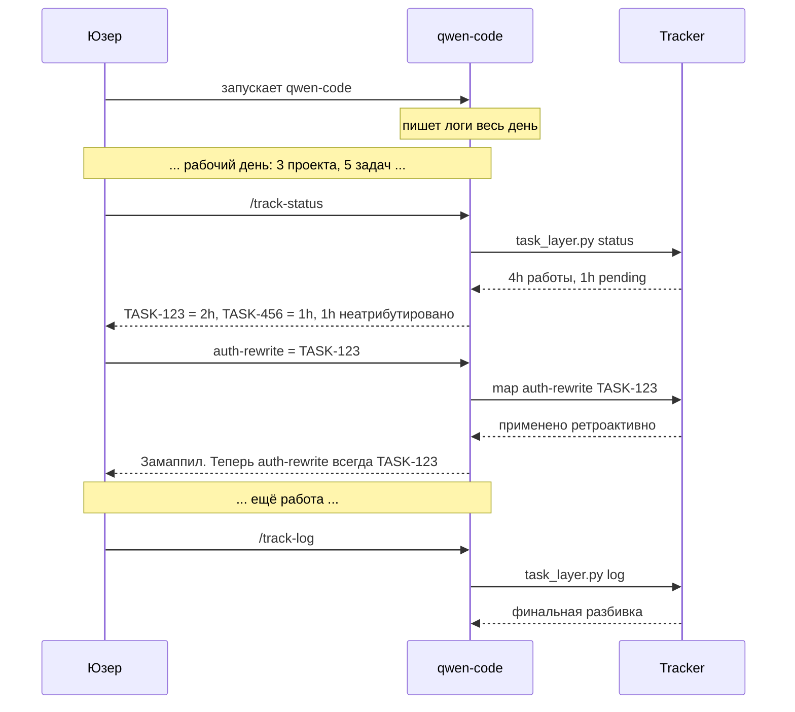

# time-tracker

Скилл для Qwen Code, который считает, сколько времени и токенов вы потратили на каждую задачу. Без внешних утилит — читает только те логи, которые qwen-code и так пишет у себя в `~/.qwen/`.

## Зачем это нужно

Если вы весь день работаете в qwen-code — три проекта параллельно, переключаетесь между задачами, запускаете subagent'ы — к вечеру хочется понимать простые вещи: сколько реально ушло на конкретную задачу, сколько токенов сожрал каждый проект, что списать в трекер времени, а что было пустой болтовнй с агентом.

Обычно для этого ставят ActivityWatch, WakaTime или ведут таймер руками. Этот скилл идёт другим путём: логи qwen-code уже содержат всё нужное (таймстампы, ветки, токены, длительность API-вызовов). Скилл их парсит и считает focus-время — то есть время вашей активной работы, а не «настенное» время от запуска до закрытия.

## Что он делает

- **Считает focus-time, а не wall-clock.** Между вашими промптами, с обрезанием idle длиннее 5 минут. Обед и переключение в браузер не идут в зачёт.
- **Атрибутирует время по веткам.** `gitBranch` в логах служит границей между задачами. Замаппили `auth-rewrite -> TASK-123` один раз — применяется ко всей истории, прошлой и будущей.
- **Поддерживает multi-task сессии.** Переключились на другую задачу посреди сессии — `/track-switch TASK-456` закрывает старый диапазон и открывает новый.
- **Работает с несколькими машинами.** Локально и через SSH — rsync-зеркало подтягивает логи с серверов, трекер видит оба источника.
- **Не фрагментирует фокус на мелких переключениях.** Зашли на `master` на полминуты «посмотреть» — сольётся с соседней задачей, а не превратится в отдельный сегмент.
- **Готовит time entries.** `task_layer.py entries` выдаёт JSON, который можно отправить в любой трекер.

## Как это устроено



Логи qwen-code — единственный источник истины. Все отчёты пересчитываются с нуля при каждом вызове, никаких промежуточных состояний, которые могут рассинхронизироваться с реальностью.

## Focus-time вместо wall-clock

Запустили qwen-code в 09:00, закрыли в 18:00 — это 9 часов «настенного» времени. Но за эти 9 часов вы, скорее всего, 15 минут смотрели на ответ агента, два часа были на обеде, полчаса переключались в браузер. Wall-clock соврёт.

Focus-time смотрит на `source: "main"` вызовы (это ваши промпты) и считает время между ними. Разрывы длиннее `idle_timeout` (по умолчанию 5 минут) обрезают сегмент.

```mermaid
gantt
    title Focus-time против wall-clock
    dateFormat HH:mm
    axisFormat %H:%M

    section Wall-clock
    Считается всё        :a1, 09:00, 540m

    section Focus-time
    Активная работа      :done, f1, 09:00, 75m
    Idle (обед)          :crit, i1, after f1, 120m
    Активная работа      :done, f2, after i1, 45m
    Idle (браузер)       :crit, i2, after f2, 30m
    Активная работа      :done, f3, after i2, 60m
```



## Атрибуция по веткам

Большую часть времени вам не нужно делать ничего — скилл сам различает задачи по `gitBranch` в логах. Когда встречает ветку без маппинга, она попадает в pending, и при следующем удобном случае можно её размечить.



Замаппили ветку один раз — она применяется ко всей прошлой и будущей истории. Через неделю активного использования у вас, скорее всего, не останется неразмеченных веток.

### Viewing-ветки

`master`, `main`, `release/*`, `develop`, `HEAD` — ветки, куда обычно заходят «посмотреть», а не работать. Зашли на 30 секунд проверить release notes — это не новая задача, скилл сольёт короткий заход в соседнюю задачу. Список настраивается в `config.json`.

## Multi-task сессии

Если вы работали над TASK-123 утром, а после обеда — над TASK-456, и всё в одной сессии, ничего пересоздавать не нужно.



`/track-switch TASK-456` закрывает предыдущий диапазон и открывает новый. Время корректно размазывается между задачами.

## Несколько машин

Если вы работаете и на ноутбуке, и на dev-сервере через SSH, скилл видит обе машины. Cron на ноутбуке раз в 5 минут стягивает логи с сервера через rsync, трекер автоматически находит зеркала в `~/.qwen-remote/*/` и помечает такие сессии как `[remote:server]`.



State-файлы (`branch_map`, `assignments`) не синхронизируются — они живут только на локальной машине, в единственном экземпляре.

## Установка

Нужно: Python 3 (от 3.8, без pip-пакетов), qwen-code (от 0.19), bash. Никаких root-прав, ActivityWatch или внешних трекеров.

```bash
# 1. Скопировать скилл в ~/.qwen/skills/time-tracker/
# 2. Сделать хуки исполняемыми
chmod +x ~/.qwen/skills/time-tracker/hooks/*.sh

# 3. Прогнать health-check
~/.qwen/skills/time-tracker/hooks/check.sh
# должно закончиться на "All checks passed"
```

Подробности — регистрация хуков в `settings.json`, настройка custom commands, конфигурация — в [INSTALL.md](INSTALL.md).

## Команды

В qwen-code доступны четыре slash-команды:

| Команда | Что делает |
|---|---|
| `/track-status` | Назначения + время по задачам + счётчик pending |
| `/track-pending` | Накопленное неатрибутированное время |
| `/track-log` | Разбивка по текущей сессии — что будет залогировано |
| `/track-switch TASK-XXX` | Переключить задачу mid-session |

То же самое доступно из терминала:

```bash
python3 task_layer.py status
python3 task_layer.py map auth-rewrite TASK-123 --repo /path/to/repo
python3 task_layer.py switch TASK-456
python3 task_layer.py pending
python3 task_layer.py entries    # JSON для списания
```

## Типичный сценарий



## Конфигурация

`~/.qwen/skills/time-tracker/config.json`:

```json
{
  "timezone": "+03:00",
  "history_horizon_days": 30,
  "idle_timeout": 300,
  "merge_short_visits_s": 300,
  "viewing_branches": ["master", "main", "release/*", "develop", "HEAD"]
}
```

## Чего он не умеет

Скилл не пытается быть всем для всех. Честный список ограничений — в [LIMITATIONS.md](LIMITATIONS.md), коротко:

- **Auto-prompt при старте сессии** работает через скрытый контекст для модели. Модель может его проигнорировать, поэтому надёжный путь — `/track-pending` руками.
- **Списание в трекер** (Jira/YouTrack) не реализовано. Есть [спецификация MCP-сервера](MCP_SERVER_SPEC.md), но самого сервера пока нет. Время готовится в JSON, отправлять надо самостоятельно.
- **Повторное использование имени ветки** после merge не различается — если создали новую ветку с тем же именем, атрибуция сломается. Это в ваших руках.
- **Числа «капают» в реальном времени** при активной сессии. Это не баг, а свойство пересчёта с нуля — данные всегда свежие.

## Частые вопросы

**Нужно ли ставить ActivityWatch, WakaTime или tmux?**
Нет. Скилл читает только то, что qwen-code уже пишет в `~/.qwen/`.

**Работает ли по SSH?**
Да. rsync-зеркало стягивает логи с сервера, трекер видит оба источника.

**А если я работаю в одном репо над разными задачами?**
`gitBranch` различает задачи даже в одном репо. Замаппили ветку — получили задачу. Если работаете в `master` над разными задачами — поможет `/track-switch`.

**Потеряются ли данные, если хук не сработал?**
Нет. Источник истины — сырые логи qwen-code. Любая команда пересчитывает из них.

## Лицензия

MIT.
